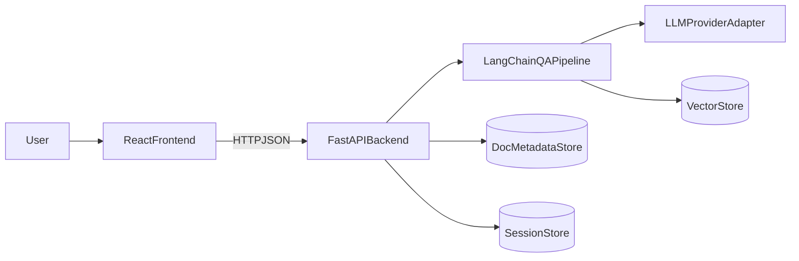

# 智能文档问答助手（架构设计 README）

## 1. 项目简介

智能文档问答助手是一个基于 AI 的文档问答系统，支持用户上传文档（TXT、Markdown），并通过自然语言提问获取答案。系统支持多轮对话与上下文保持，同时支持切换不同 AI 服务提供商（OpenAI、Claude、本地模型等）。

本 README 仅聚焦**技术选型、架构分层、模块边界和落地方式**，不展开复杂实现细节。

## 2. 功能范围

### 2.1 文档管理

- 上传文档：支持 `TXT`、`Markdown`
- 文档解析：抽取文本内容并切分为可检索片段
- 文档存储：保存文档元数据与索引数据
- 文档操作：查询、列表、删除

### 2.2 Agent 问答

- 基于文档内容进行问答（RAG）
- 生成准确、连贯的回答
- 支持多轮对话与上下文延续

### 2.3 系统配置

- 支持配置 AI Provider（OpenAI / Claude / 本地模型）
- 支持模型参数配置（如 model、temperature、max tokens）

### 2.4 UI 页面（已实现）

- 文档管理页面（上传、列表、多选、删除、开启新对话）
- Agent 问答页面（会话列表、消息区、输入区、对话文档侧边栏、多轮对话）
- 系统配置页面（内置/自定义模型、Provider、Key、模型参数）

## 3. 技术栈（仅列技术与用途）

### 前端

- `Bun`: 运行环境
- `React`：应用框架
- `Vite`：构建与开发环境
- `TailwindCSS`：样式系统
- `shadcn/ui`：基础 UI 组件
- `Zustand`：本地状态管理（会话状态、配置状态）
- `TanStack Query`：服务端数据请求与缓存
- `Biome`：格式化代码

### 后端

- `Python`：服务开发语言
- `FastAPI`：REST API 框架
- `LangChain`：问答链路编排（检索 + 生成）
- `OpenAPI`：接口定义与文档

## 4. 系统架构



### 分层说明

- 前端层：页面渲染、交互、状态与请求管理
- API 层：统一接口、鉴权（可选）、参数校验、错误处理
- 业务层：文档处理、问答编排、会话管理、配置管理
- 存储层：文档元数据、向量索引、会话记录

## 5. 核心模块设计

### 5.1 文档管理模块

- **输入**：上传文件（TXT/MD）或直接提交纯文本
- **处理**：解析文本 -> 文本切分 -> 向量化 -> 入库
- **输出**：文档列表、删除结果
- **接口**：
  - `GET /api/v1/documents`（列表）
  - `POST /api/v1/documents`（直接提交纯文本）
  - `POST /api/v1/documents/upload`（上传文件）
  - `DELETE /api/v1/documents`（请求体 `{ "ids": [...] }` 批量删除）

### 5.2 Agent 问答与会话模块

- **输入**：用户问题、会话 ID（可选）、已选文档
- **处理**：检索相关片段 -> 组装上下文 -> LLM 生成 -> 保存会话
- **输出**：回答文本、引用片段（可选）、会话上下文
- **接口**：
  - `POST /api/v1/chat/completions`
  - `POST /api/v1/chat/completions/stream`（流式问答，SSE）
  - `GET /api/v1/chat/sessions`
  - `PUT /api/v1/chat/sessions`

### 5.3 系统配置模块

- **输入**：多个模型配置、默认模型、Provider 参数、MinerU Token（可选）
- **处理**：配置校验与持久化，聊天请求按 `modelConfigId` 选模并可在同一会话内切换
- **输出**：模型配置列表、Provider 列表、当前会话模型快照
- **接口**：
  - `GET /api/v1/system/providers`
  - `GET /api/v1/system/llm-configs`
  - `POST /api/v1/system/llm-configs`
  - `PUT /api/v1/system/llm-configs/{config_id}`
  - `DELETE /api/v1/system/llm-configs/{config_id}`
  - `POST /api/v1/system/llm-configs/test`（模型连通性检测）
  - `GET /api/v1/system/mineru-token`、`PUT /api/v1/system/mineru-token`（MinerU Token 查询与设置）

## 6. 前端架构（React）

### 页面划分

- `/`：文档管理
- `/chat`：Agent 问答（新会话）
- `/chat/:id`：Agent 问答（历史会话）
- `/settings`：系统配置

### 目录结构（当前实现）

```text
src/
  app/                 # 路由、Provider、route-context
  pages/               # 页面组件（documents / chat / settings）
  components/          # layout、documents、chat、settings、ui
  hooks/               # use-documents-query、use-chat-sessions、use-app-chat-state 等
  lib/
    api/               # Documents / Chat / ChatSessions API 封装
    documents-storage  # 文档、会话、系统配置的本地存储
```

### 状态与请求

- `TanStack Query`：文档列表、会话历史、配置读取等服务端状态
- `Zustand`：当前会话、输入草稿、UI 偏好等本地状态

## 7. 后端架构（FastAPI + LangChain）

### 分层建议

```text
backend/
  app/
    api/               # FastAPI routers
    schemas/           # Pydantic 请求/响应模型
    services/          # 业务服务（文档/问答/配置）、LLM 调用（llm_gateway）、向量检索
    repositories/      # 数据访问层
    core/              # 配置、日志、异常处理
```

### LLM 与向量检索

- LLM 调用由 `services/llm_gateway` 统一封装（HTTP 调用 OpenAI 兼容接口与 Claude），支持 openai、claude、local、community 等 provider。
- 向量检索使用 Chroma（`VectorStoreService`），持久化目录可配置。

## 8. 数据与存储（最小可行）

- 文档元数据与会话记录：`SQLite`（开发）/ `PostgreSQL`（生产）
- 向量检索：`Chroma`（持久化目录可配置）

> 说明：开发阶段可全本地（SQLite + Chroma），部署阶段可替换为 PostgreSQL + 托管向量库。

## 9. API 分组（OpenAPI）

- `Documents API`：文档上传、查询、删除
- `Chat API`：问答与会话
- `System API`：Provider 与配置

OpenAPI 文档建议：

- `GET /openapi.json`
- `GET /docs`（Swagger UI）

## 10. 部署运行（Docker）

### 10.1 容器组成

- `frontend`：React + Vite 构建后由 Nginx 提供静态服务
- `backend`：FastAPI 服务

### 10.2 环境变量（示例）

后端：

- `APP_ENV=dev`
- `chroma_persist_path`（Chroma 持久化目录，可选）

前端：

- `VITE_API_BASE_URL`：后端 API 基地址（默认 `http://localhost:8000`，Docker 环境下可设为 `http://backend:8000`）

### 10.3 启动方式（示例）

```bash
docker compose up --build
```

启动后访问：

- 前端：`http://127.0.0.1:80`
- 后端：`http://127.0.0.1:8000`
- 后端文档：`http://127.0.0.1:8000/api/v1/docs`

## 11. 测试说明（最小可行）

- 前端单测：组件渲染、页面交互、请求状态
- 后端单测：文档服务、问答服务、配置服务
- 后端集成测试：文档上传 -> 索引 -> 提问 -> 返回答案

## 12. 扩展方向（加分项）

- 增加 `PDF`、`Word` 解析能力（统一接入文档解析管道）
- 增加检索策略（混合检索、重排）
- 增加多租户与权限控制（如后续需要）

---

如果你需要，我可以下一步基于这份 README 再补一个“最小可运行目录骨架（前后端项目结构 + 接口占位）”。
