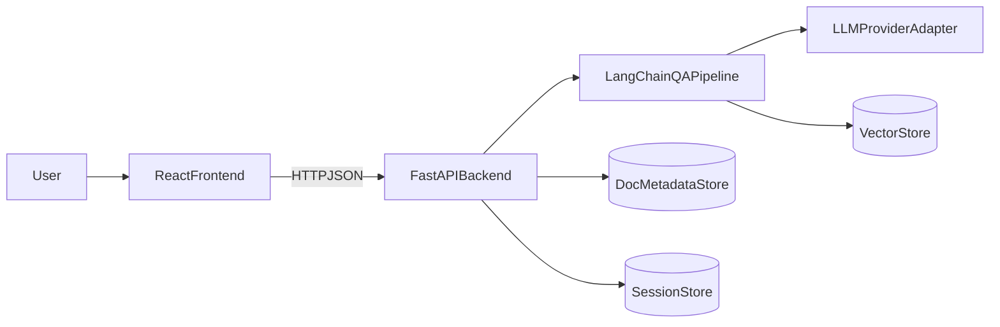

# 智能文档问答助手 — 架构设计文档

## 1. 项目简介

智能文档问答助手是一个基于 AI 的文档问答系统，支持用户上传多种格式的文档（TXT、Markdown，以及可选 PDF、Word 等），并通过自然语言提问获取答案。系统支持多轮对话与上下文保持，同时支持切换不同 AI 服务提供商（OpenAI、Claude、本地模型等）。

本文档聚焦**技术选型、架构分层、模块边界和落地方式**，不展开复杂实现细节。

## 2. 功能范围

### 2.1 文档管理

- 上传文档：支持 `TXT`、`Markdown`；配置 MinerU 后支持 PDF、Word、PPT、图片、HTML
- 文档解析：抽取文本内容并切分为可检索片段
- 文档存储：保存文档元数据与向量索引
- 文档操作：查询、列表、批量删除

### 2.2 Agent 问答

- 基于文档内容进行问答（RAG）
- 生成准确、连贯的回答
- 支持多轮对话与上下文延续

### 2.3 系统配置

- 支持配置 AI Provider（OpenAI / Claude / 本地模型 / 社区兼容）
- 支持模型参数配置（如 model、temperature、max tokens、apiBase）
- 支持 MinerU Token 配置（用于 PDF/Word 等格式解析）

### 2.4 UI 页面

- 文档管理页面：上传、列表、多选、删除、勾选文档后开启新对话
- Agent 问答页面：会话列表、消息区、输入区、对话文档侧边栏、多轮对话
- 系统配置页面：模型配置 CRUD、Provider、API Key/Base、模型参数、MinerU Token

## 3. 技术栈

### 3.1 前端

| 技术 | 用途 |
|------|------|
| Bun | 运行与包管理 |
| React | 应用框架 |
| TypeScript | 类型与开发体验 |
| Vite | 构建与开发环境 |
| TailwindCSS | 样式系统 |
| shadcn/ui | 基础 UI 组件 |
| React Router | 路由 |
| Zustand | 本地状态（会话、输入草稿、UI 偏好） |
| TanStack Query | 服务端状态与请求缓存 |
| Biome | 格式化与 Lint |

### 3.2 后端

| 技术 | 用途 |
|------|------|
| Python 3.12 | 服务开发语言 |
| FastAPI | REST API 框架 |
| Pydantic | 请求/响应模型与配置 |
| LangChain | 问答链路编排（检索 + 生成） |
| SQLite | 文档元数据、会话、配置持久化 |
| Chroma | 向量检索 |
| OpenAPI | 接口定义与 Swagger 文档 |

## 4. 系统架构

### 4.1 整体架构图



### 4.2 分层说明

- **前端层**：页面渲染、交互、状态与请求管理
- **API 层**：统一接口、参数校验、错误处理
- **业务层**：文档处理、问答编排、会话管理、配置管理
- **存储层**：文档元数据（SQLite）、向量索引（Chroma）、会话与消息（SQLite）

## 5. 核心模块设计

### 5.1 文档管理模块

- **输入**：上传文件（TXT/MD 或 MinerU 支持的 PDF/Word 等）或直接提交纯文本
- **处理**：解析/规范化文本 → 文本切分 → 向量化 → 写入文档表与向量库
- **输出**：文档列表、删除结果
- **接口**：`GET/POST /api/v1/documents`、`POST /api/v1/documents/upload`、`DELETE /api/v1/documents`

### 5.2 Agent 问答与会话模块

- **输入**：用户问题、可选会话 ID、已选文档、可选模型配置 ID
- **处理**：按文档检索相关片段 → 组装上下文 → LLM 生成 → 保存会话与消息
- **输出**：回答文本、引用片段、会话 ID、实际使用的 provider/modelName
- **接口**：`POST /api/v1/chat/completions`、`POST /api/v1/chat/completions/stream`、`GET/PUT /api/v1/chat/sessions`

### 5.3 系统配置模块

- **输入**：多组模型配置、默认模型、Provider 参数、MinerU Token（可选）
- **处理**：配置校验与持久化；聊天请求按 `modelConfigId` 选模，同一会话内可切换
- **输出**：Provider 列表、模型配置列表、连通性检测结果、MinerU Token 状态
- **接口**：`GET /api/v1/system/providers`、`GET/POST/PUT/DELETE /api/v1/system/llm-configs`、`POST /api/v1/system/llm-configs/test`、`GET/PUT /api/v1/system/mineru-token`

## 6. 前端架构（React）

### 6.1 页面与路由

| 路径 | 说明 |
|------|------|
| `/` | 文档管理 |
| `/chat` | Agent 问答（新会话） |
| `/chat/:id` | Agent 问答（历史会话） |
| `/settings` | 系统配置 |

### 6.2 目录结构

```text
frontend/src/
  app/                 # 路由、Provider、route-context
  pages/               # 页面组件（documents / chat / settings）
  components/          # layout、documents、chat、settings、ui
  hooks/               # use-documents-query、use-chat-sessions、use-app-chat-state 等
  lib/
    api/               # Documents / Chat / ChatSessions / System API 封装
    documents-storage  # 文档相关工具
  types/               # 类型定义
```

### 6.3 状态与请求

- **TanStack Query**：文档列表、会话列表、模型配置列表等服务端状态
- **Zustand**：当前会话、输入草稿、UI 偏好等本地状态
- 所有后端请求统一通过 `lib/api` 封装，组件不直接写裸 `fetch`

## 7. 后端架构（FastAPI + LangChain）

### 7.1 分层与目录

```text
backend/app/
  api/v1/              # FastAPI 路由（health、documents、chat、system）
  schemas/             # Pydantic 请求/响应模型
  services/            # 文档服务、RAG、聊天、会话、配置、LLM 网关、向量检索
  repositories/        # 数据访问（文档、会话、配置）
  core/                # 配置、数据库初始化、日志
```

### 7.2 LLM 与向量检索

- **LLM**：由 `services/llm_gateway` 统一封装，支持 openai、claude、local、community；通过 HTTP 调用 OpenAI 兼容接口或 Claude API
- **向量检索**：Chroma（`VectorStoreService`），持久化目录可配置；文档切块后同步写入向量库，问答时按已选文档检索相关片段

## 8. 数据与存储

### 8.1 存储选型

- **文档元数据与会话**：SQLite（开发）/ 可替换为 PostgreSQL（生产）
- **向量检索**：Chroma，持久化目录由环境变量配置

### 8.2 主要数据表（SQLite）

- `documents`：文档 id、名称、标题、纯文本、类型（`doc_type`，表示存储内容格式：txt/markdown）、状态、更新时间、可选 `source_format`（原始上传格式，如 pdf/docx，仅 MinerU 解析的文档有值；前端展示类型时优先使用）
- `document_chunks`：切块 id、文档 id、内容、元数据
- `chat_sessions`：会话 id、标题、已加载/待加载文档、当前模型配置、创建/更新时间
- `chat_messages`：消息 id、会话 id、角色、内容、创建时间
- `llm_configs`：模型配置（provider、apiKey、apiBase、modelName、温度等）
- `system_settings`：系统级键值（如 MinerU Token 状态）

### 8.3 数据流概要

1. 上传文件或提交文本 → 规范化并写入 `documents`
2. 服务层切块写入 `document_chunks`，并同步到 Chroma
3. 用户提问 → 按已选文档在 Chroma 中检索 → 组装上下文 → LLM 生成 → 写入 `chat_messages` 并更新会话快照
4. 会话列表与消息由 `GET/PUT /api/v1/chat/sessions` 读写

## 9. API 分组与文档

- **Documents API**：文档上传、查询、删除
- **Chat API**：问答（含流式）、会话列表与持久化
- **System API**：Provider 列表、模型配置 CRUD、连通性测试、MinerU Token
- **Health API**：健康检查

运行时可通过以下地址查看 OpenAPI 文档：

- `GET /api/v1/docs`（Swagger UI）
- `GET /api/v1/redoc`（ReDoc）
- `GET /api/v1/openapi.json`（OpenAPI JSON）

详细请求/响应约定见 [接口文档](./API.md)。

## 10. 扩展与加分项

- **多格式解析**：已通过 MinerU 支持 PDF、Word、PPT、图片、HTML；配置 MinerU Token 后上传即可使用
- **检索增强**：可扩展混合检索、重排等策略
- **多租户与权限**：可按后续需求在 API 层与存储层扩展
